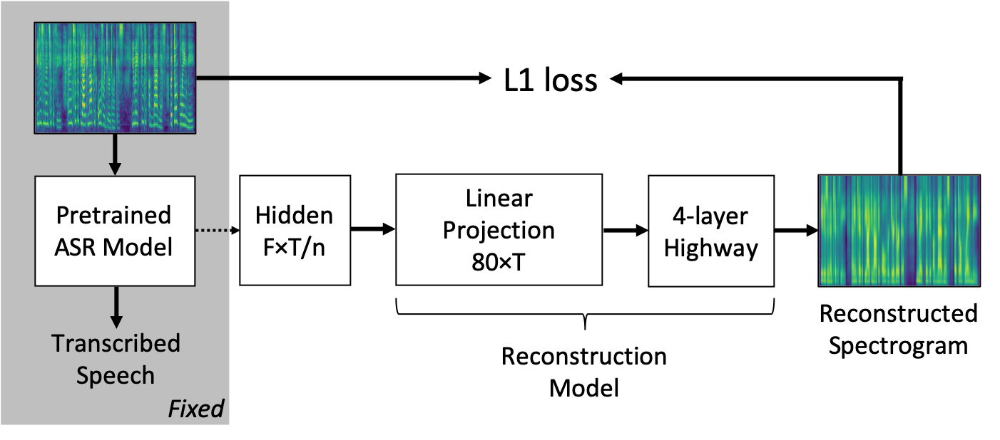

# Voice-in-ASR
Demo page for the paper:

[WHAT DOES A NETWORK LAYER HEAR? ANALYZING HIDDEN REPRESENTATIONS OF END-TO-END ASR THROUGH SPEECH SYNTHESIS](https://arxiv.org/abs/1911.01102)

## Proposed Probing Model


## Citation
```
@misc{1911.01102,
Author = {Chung-Yi Li and Pei-Chieh Yuan and Hung-Yi Lee},
Title = {What does a network layer hear? Analyzing hidden representations of end-to-end ASR through speech synthesis},
Year = {2019},
Eprint = {arXiv:1911.01102},
}
```
